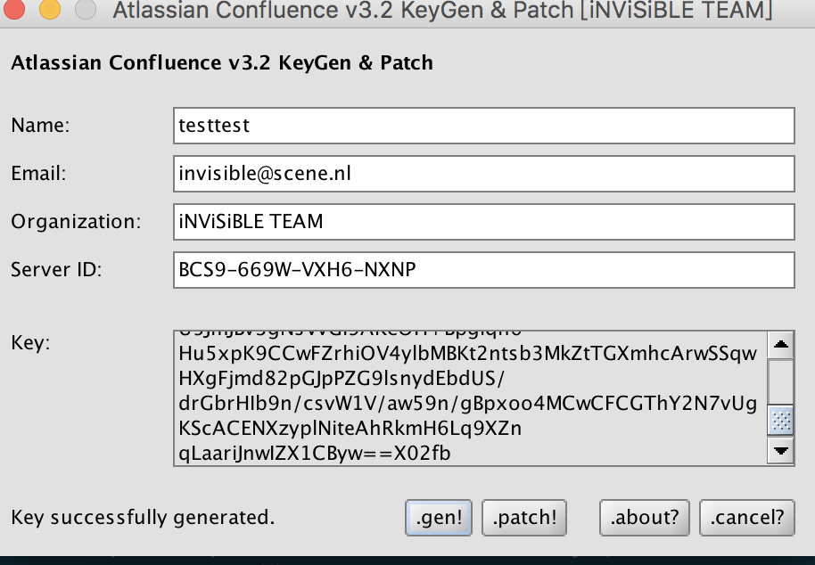

# 记录一次confluence6.15.2+Mysql5.6.44 安装与破解
- Install Mysql
- Install Confluence
- 破解Confluence

## Install Mysql
Confluence6.15.2 支持Mysql5.6,5.7版本，且不支持mysql的变体（如Mariadb），存储引擎必须为innoDB
- 配置yum源（由于RPM安装需要很多依赖，这里直接使用yum安装）
```bash
cd /etc/yum.repos.d &&
cat>mysql-community.repo <<EOF
[mysql57-community]
name=MySQL 5.7 Community Server
baseurl=http://repo.mysql.com/yum/mysql-5.7-community/el/7/\$basearch/
enabled=1
gpgcheck=0
gpgkey=file:///etc/pki/rpm-gpg/RPM-GPG-KEY-mysql
EOF 
```
- 检查repolist 并安装mysql
```bash
yum repolist all|grep mysql
yum install mysql-community-server
```
- 启动Mysql
```bash
systemctl start mysqld
```
- 查看原始密码，修改root密码
```bash
grep "temporary password" /var/log/mysqld.log #获得临时密码
mysql -uroot -p
mysql > set password for root@localhost = password('xxxxxxxxx');
exit
```
- 设置Mysql for Confluence
```bash
echo "!includedir /etc/my.cnf.d" >> /etc/my.cnf # if the line not exists
cd /etc/my.cnf.d/
cat >mysql.cnf <<EOF
[mysqld]
character-set-server=utf8
collation-server=utf8_bin
default-storage-engine=INNODB
max_allowed_packet=256M
innodb_log_file_size=2GB
transaction-isolation=READ-COMMITTED
EOF
```
- 重启mysql
```bash
systemctl restart mysql
```
- 进入mysql创建confluence数据库和用户
```bash
mysql -uroot -p
mysql >CREATE DATABASE confluence CHARACTER SET utf8 COLLATE utf8_bin;
mysql >GRANT ALL PRIVILEGES ON confluence.* TO '<user>'@'localhost' IDENTIFIED BY '<password>';
exit
```

## Install confluence 6.15.2
- 下载confluence6.15.2 birnary 文件（由于文件较大，这里将不上传，请自行下载）
```bash
wget https://www.atlassian.com/software/confluence/downloads/binary/atlassian-confluence-6.15.2-x64.bin
```
- 安装confluence,安装option如图一
```bash
# 这里在安装之前，如果当前机器上曾经安装过confluence，请先清楚/opt/atlassian/,/var/atlassian/这两个目录
chmod +x atlassian-confluence-6.15.2-x64.bin
./atlassian-confluence-6.15.2-x64.bin
```

- 访问浏览器
```
http://ip:8090
```
- Setup Confluence


将这里的服务器ID“BCS9-669W-VXH6-NXNP”拷贝出来，已备破解之用

## 破解Confluence
- Confluence Mysql 驱动文件
```bash
cp src/mysql-connector-java-5.1.47-bin.jar /opt/atlassian/confluence/confluence/WEB-INF/lib/
```
- 替换atlassian-extras-decoder-v2-3.4.1.jar
```bash
#backup 原有的文件,以备回退之用
cp /opt/atlassian/confluence/confluence/WEB-INF/lib/atlassian-extras-decoder-v2-3.4.1.jar /opt/atlassian-extras-decoder-v2-3.4.1.jar.bak
# 替换atlassian-extras-decoder-v2-3.4.1.jar
cp src/atlassian-extras-decoder-v2-3.4.1.jar /opt/atlassian/confluence/confluence/WEB-INF/lib/atlassian-extras-decoder-v2-3.4.1.jar
```
- 获取授权码
将"confluence破解工具"整个copy到本地(这里的实验环境的MacOS）
```bash
cd confluence破解工具
java -jar confluence_keygen.jar
```
会弹出如下图所以的对话框，将上面copy出来的‘BCS9-669W-VXH6-NXNP” 输入Server ID，然后点击"gen",就会产生key,将这个key粘贴出来,备用。


- 重启confluence
```bash
/etc/init.d/confluence restart
```
- 访问浏览器，将上面的key粘贴进去，下一步完成confluence配置
